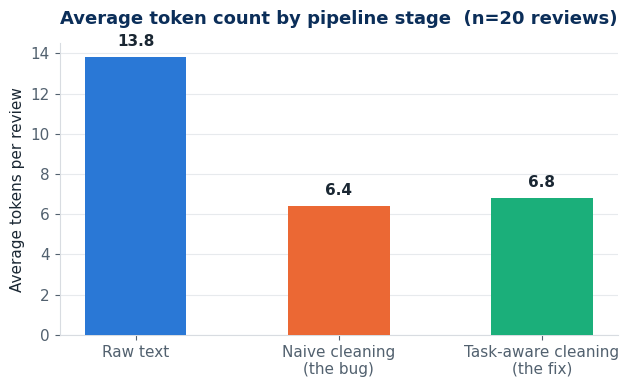
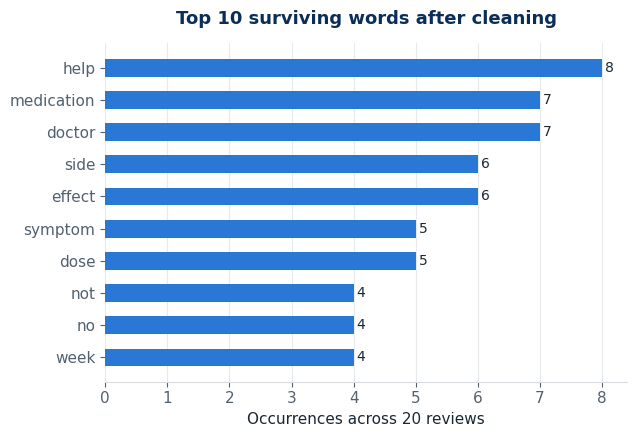

  

<h1 align="center">🩺 Week 8 · Day 1</h1>
<h3 align="center">Sprint 3 Planning &amp; NLP Preprocessing</h3>

  
  
  
  
  

<i>"Every model that will ever face the real world first has to survive the mess of raw human language."</i>

---

## 📖 The Story So Far

Sprint 2 closed with a trained, validated model that beats the Week 6 baseline. That was the hard part — proving the
idea works. Sprint 3 is about something less glamorous but just as critical: turning that idea into a **trustworthy,
end-to-end system**.

Today opens a new chapter in that system's life — **text**. Not every signal a model needs arrives as a clean number
in a spreadsheet column; a lot of it arrives as messy, inconsistent, human-written text. Before any of it can reach a
model, it has to be tamed. That taming process is **NLP preprocessing**, and it's the whole story of Day 1.

## 🎯 Learning Objectives

| | Objective |
|---|---|
| 🧩 | Preprocess raw text for ML: tokenization, cleaning, and stop-word removal |
| 🌱 | Apply lemmatization appropriately — and know when *not* to over-clean |
| 🗺️ | Plan Sprint 3: define the integration & evaluation backlog |

## 🗂️ Sprint 3 Backlog

| # | Backlog item | Lands on |
|---|---|---|
| 1 | Text preprocessing pipeline (tokenize → clean → lemmatize) | **Day 1** ✅ |
| 2 | Text representation: TF-IDF vs. word embeddings | Day 2 |
| 3 | Image preprocessing + augmentation pipeline (OpenCV) | Day 3 |
| 4 | End-to-end `predict()` pipeline + error analysis | Day 4 |
| 5 | Full evaluation, SHAP explainability, Sprint Review & Retrospective | Day 5 |

> [!TIP]
> **🎬 Director's Commentary** — Planning feels like admin work, but skipping it is exactly how a sprint turns into
> five days of unfocused notebook-editing. Two minutes writing the backlog above saved me from re-deciding "what am I
> doing today?" every single morning this week.

## 🔬 What Actually Happens in the Notebook

Our capstone (Cardiac Patient Monitoring) is tabular, so it has no text column of its own — but the brief is explicit:
*"take a raw text sample (or the project's text data)."* To keep practicing on real, messy text, the notebook reuses
the **UCI Drug Review dataset** from Week 7 · Day 4 — it keeps the health-domain thread of this internship alive, and
drug reviews are exactly the kind of noisy, opinionated human text preprocessing exists for.

1. **Tokenize** a sample review with `nltk.word_tokenize`.
2. **Clean it the "textbook" way** — lowercase, strip punctuation, remove default stop words, lemmatize.
3. **Catch a real bug in that textbook pipeline.**
4. **Fix it** with a task-aware stop-word list, and prove the fix on 20 reviews.

> [!WARNING]
> **The bug:** NLTK's default English stop-word list includes the word **`"not"`**. Run the naive pipeline on *"This
> medication did **NOT** help my symptoms"* and it silently deletes the negation — the cleaned text reads like the
> medication *did* help. For any task where polarity matters (sentiment, side-effect reporting, and — closer to home —
> clinical notes for the Cardiac Monitoring project, like *"patient denies chest pain"* vs. *"patient reports chest
> pain"*) that one dropped word flips the meaning of the entire sentence.

> [!TIP]
> **The fix:** carve negation terms (`not`, `no`, `never`, contracted negatives) out of the stop-word list before
> applying it. Result, measured across 20 reviews: keeping every negation intact costs **~0.4 extra tokens per
> review on average** — essentially free compared to the meaning it protects.

## 📊 The Evidence

  
   Raw text shrinks by more than half after cleaning — and the task-aware fix costs almost nothing extra.

  
   "not" and "no" are still in the top 10 after cleaning — proof the fix actually holds across the corpus, not just one example.

## 📝 Preprocessing Choices — Documented

| Choice | Decision | Why |
|---|---|---|
| Tokenizer | `nltk.word_tokenize` | Word-level, simple, inspectable |
| Case & punctuation | Fully normalized | Safe here, no signal lost |
| Stop words | NLTK default **minus negations** | Deleting "not" is a correctness bug, not a simplification |
| Lemmatization | Verb-first, noun-fallback | Keeps tokens as real, readable dictionary words |

> [!NOTE]
> **Why this matters beyond Day 1:** the same negation-awareness principle is the basis of **NegEx**, a real
> algorithm used in clinical NLP to detect negated findings in medical notes — directly relevant if the Cardiac
> Monitoring project ever ingests physician notes instead of only structured vitals.

## 🧰 Tools Used

## 📓 The Notebook

**[→ Open day1.ipynb](./day1.ipynb)** for the full, executed walkthrough — code, output, and both charts above,
generated live.

---

Week 8 · Sprint 3 · Day 1 of 5 → <b>Day 2: Text Representation (TF-IDF &amp; Embeddings)</b>

